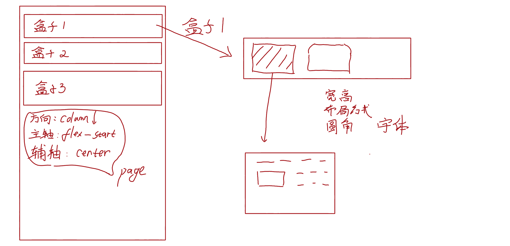
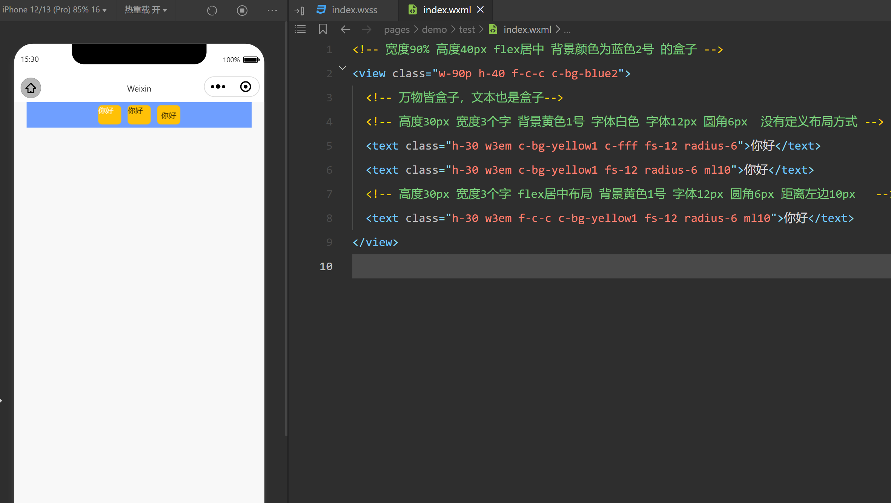
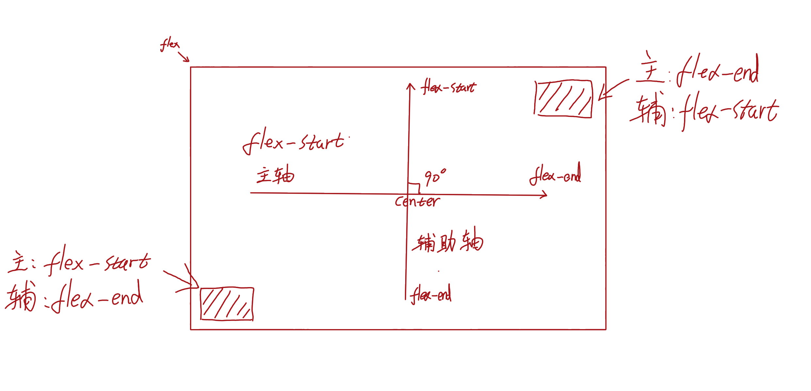

# VaaWxss
**微信小程序**  的 **样式框架**

## 我们提供
- [x] vaa.wxss                     样式库
- [x] vaa-min.wxss                 样式库(压缩)
- [x] fonts
    - [x] fonts/fontAwesome.wxss       字体图标库
    - [x] fonts/fontAwesomes.wxss      字体图标库

我们使用的字体图标库是： `font-awesome-4.7.0` 版本

## 如何使用

1. **按照下面的推荐的目录结构引入相关文件**
```
Project
│
└───fonts                 （←需要引入）
│   │   fontAwesome.wxss  （←需要引入）
│   │   fontAwesomes.wxss （←需要引入）
└───pages
│   │
│   └───index
│   │   │   ...
│   │   ...
│
│   app.wxss
│   vaa.wxss              （←需要引入）
│   app.json
│   README.md
│   project.config.json
```

*`vaa.wxss`将`fontAwesome`作为默认的字体图标库*

2. **页面中引入**
需要使用 **vaa** 样式库的页面，在该目录下的`.wxss`文件中引入 `vaa.wxss`文件，语法是：
```wxss
@import "/vaa.wxss";
```

## 用法
Page的默认布局是flex布局，主轴为垂直方向，自上而下居中排列
我们需要将元素分解为一个一个盒子

**万物皆盒子**



### 步骤
1. 定义2要素: **宽高**+**布局**
2. 调整细节：`[字体大小]`、`[字体粗细]`、`[字体颜色]`、`[背景颜色]`、`[圆角]`、`[外边距]`、`[内边距]`、`[阴影]`...等

### DEMO



## 基本概念
1. **Flex布局**
`Flex`主要由两个轴来控制对齐方式：主轴、垂直轴（辅助轴）
定义了flex方向的，该方向称为`主轴`,与主轴垂直的轴为`辅助轴`



2. **预设布局类-主轴水平方向**
类命名规则：[flex布局和方向]-[主轴对齐方式首字母]-[辅助轴对齐方式首字母]
比如： `f-c-c` 代表 `使用flex布局且主轴为水平方向` + `主轴对齐方式为center` + `辅助轴对齐方式为center`
```css
/* 仅展示部分 */
.f-s-c{display: flex;justify-content: flex-start;align-items: center;}
.f-s-s{display: flex;justify-content: flex-start;align-items: flex-start;}
.f-s-b{display: flex;justify-content: flex-start;align-items: baseline;}
.f-s-e{display: flex;justify-content: flex-start;align-items: flex-end;}
.f-e-c{display: flex;justify-content: flex-end;align-items: center;}
.f-e-s{display: flex;justify-content: flex-end;align-items: flex-start;}
.f-e-b{display: flex;justify-content: flex-end;align-items: baseline;}
.f-e-e{display: flex;justify-content: flex-end;align-items: flex-end;}
...
```

2. **预设布局类-主轴垂直方向**
```css
/* 仅展示部分 */
.fc-s-c{display: flex;flex-direction: column;justify-content: flex-start;align-items: center;}
.fc-s-s{display: flex;flex-direction: column;justify-content: flex-start;align-items: flex-start;}
.fc-s-e{display: flex;flex-direction: column;justify-content: flex-start;align-items: flex-end;}
.fc-e-c{display: flex;flex-direction: column;justify-content: flex-end;align-items: center;}
.fc-e-s{display: flex;flex-direction: column;justify-content: flex-end;align-items: flex-start;}
.fc-e-e{display: flex;flex-direction: column;justify-content: flex-end;align-items: flex-end;}
...
```

3. **宽高**
    - 高度
    ```css
    /* 类别1：    百分比:1-100，p代表percent */
    .h-1p{height:1%;}.h-2p{height:2%;}.h-3p{height:3%;}....h-100p{height:100%;}

    /* 类别2：    像素：1-100px */
    .h-1{height: 1px;}.h-2{height: 2px;}.h-3{height: 3px;}....h-100{height: 100px;}

    /* 类别3：    像素：100-200px,仅支持偶数 */
    .h-102{height: 102px;}.h-104{height: 104px;}.h-106{height: 106px;}....h-200{height: 200px;}

    /* 类别4：    像素：200-600px,每隔十个 */
    .h-210{height: 210px;}.h-220{height: 220px;}.h-230{height: 230px;}....h-600{height: 600px;}

    ```
    - 宽度
    ```css
    /* 支持与高度 [类别1，2，3] 一致的规则 */
    /* 支持em */
    .w1em{width: 1em;}.w2em{width: 2em;}.w3em{width: 3em;}.w4em{width: 4em;}.w5em{width: 5em;}.w6em{width: 6em;}.w7em{width: 7em;}.w8em{width: 8em;}.w9em{width: 9em;}.w10em{width: 10em;}
    .w1em5{width: 1.5em;}.w2em5{width: 2.5em;}.w3em5{width: 3.5em;}.w4em5{width: 4.5em;}.w5em5{width: 5.5em;}.w6em5{width: 6.5em;}.w7em5{width: 7.5em;}.w8em5{width: 8.5em;}.w9em5{width: 9.5em;}.w10em5{width: 10.5em;}
    ```

4. **字体和背景颜色**
    `c-[颜色ID]` 表示字体颜色
    `c-bg-[颜色ID]` 表示背景颜色
    我们预设了5种颜色类别：`gray`、`yellow`、`red`、`blue`和`green`,每种的颜色ID全都支持0-9
    
    例如：
    ```css
    .c-yellow6{color: #fd7e14;}
    .c-bg-yellow6{background-color: #fd7e14;}
    /* 支持黑白 */
    .c-fff{color: #fff;}
    .c-000{color: #000;}
    .c-bg-fff{background-color: #fff;}
    .c-bg-000{background-color: #000;}
    ```

5. **圆角**
圆角范围：1px-50px
```css
/* 四个角圆 */
.radius-1{border-radius: 1px;}.radius-2{border-radius: 2px;}.radius-3{border-radius: 3px;}
...
.radius-50{border-radius: 50px;}

/* 上两个角圆 下两角方*/
.radius-1-0{border-radius: 1px 1px 0 0;}.radius-2-0{border-radius: 2px 2px 0 0;}

/* 上两个角方 下两角圆*/
.radius-0-1{border-radius: 0 0 1px 1px;}.radius-0-2{border-radius: 0 0 2px 2px;}

/*左两角圆 右两角方*/
.radius-l1-0{border-radius: 1px 0 0 1px;}.radius-l2-0{border-radius: 2px 0 0 2px;}

/*左两角方 右两角圆*/
.radius-r1-0{border-radius: 0 1px 1px 0;}.radius-r2-0{border-radius: 0 2px 2px 0;}

/*右下圆角，其它方*/
.radius-r-b1{border-radius:0 0 1px 0;}.radius-r-b2{border-radius:0 0 2px 0;}

```

6. **定位**
```css
.relative{position: relative;}
.absolute{position: absolute;}
.fixed{position: fixed;}

/* left right top bottom ntop(负数偏移) nbottom（负数偏移） */
/*范围0-30px*/
.top-0{top: 0px;}top-1{top: 1px;}.top-2{top: 2px;}.top-3{top: 3px;}
.right-0{right: 0px;}.right-1{right: 1px;}.right-2{right: 2px;}.right-3{right: 3px;}
.left-0{left: 0px;}.left-1{left: 1px;}.left-2{left: 2px;}.left-3{left: 3px;}
.bottom-0{bottom: 0px;}.bottom-1{bottom: 1px;}.bottom-2{bottom: 2px;}.bottom-3{bottom: 3px;}
/*范围1-30px*/
.ntop-1{top: -1px;}.ntop-2{top: -2px;}.ntop-3{top: -3px;}
.nbottom-1{bottom: -1px;}.nbottom-2{bottom: -2px;}.nbottom-3{bottom: -3px;}
```

7. **上下左右外边距**
- `mt`：margin-top,1-30px范围全部支持,30-100px隔5支持，100-200px隔10支持
- `mt-`：margin-top（负数）,1-30px范围全部支持
- `ml`: margin-left,1-30px范围全部支持
    - **mlauto**:margin-left:auto
- `mr`: margin-right,1-30px范围全部支持
- `mb`: margin-bottom,1-30px范围全部支持

8. **内边距**
- padding：上下左右四个内边距，1-30px范围全部支持。eg:`padding-1`
- padding-both：左右两个内边距（上下边距为0），1-30px范围全部支持。eg:`padding-both-1`

9. **侧边线**
支持盒子的上、下、左、右，每种支持4种样式的灰色
```css
.b-line0{border-bottom: 1px solid #e7e7e7;}
.t-line1{border-top: 1px solid #cfcfcf;}
.r-line2{border-right: 1px solid #b8b7b7;}
.l-line3{border-left: 1px solid #a1a0a0;}
```

10. **边框(4种边框+白边框)**
```css
.border0{border:1px solid #e7e7e7;}
.border1{border:1px solid #cfcfcf;}
.border2{border:1px solid #b8b7b7;}
.border3{border:1px solid #a1a0a0;}
.border-fff{border:1px solid #ffffff;}

/*虚线和点*/
.dotted{border:1px dotted #cccccc}
.dashed{border:1px dashed #cccccc;}
```

11. **盒子阴影**
支持6种阴影效果：`shadow0`、`shadow1`、`shadow2`、`shadow3`、`shadow4`、`shadow5`


12. **文本溢出**
支持1行到5行的文本溢出省略号显示效果：`to1`、`to2`、`to3`、`to4`、`to5`
```css
.to5{
overflow: hidden;
display: -webkit-box;
-webkit-box-orient: vertical;
-webkit-line-clamp: 5;
}
```

13. **overflow**
```css
.overflow{overflow: hidden;}

```

14. **文字滚动**

    **`.roll`**

15. **图层**
    - `z-index-1`-`z-index-10`
    - `z-index-100`
    - `z-index-200`

16. **透明度**
```css
.o5{opacity: 0.5;}.o6{opacity: 0.6;}.o7{opacity: 0.7;}.o8{opacity: 0.8;}.o9{opacity: 0.9;}.o10{opacity: 1;}
```


17. **显示&隐藏**
```css
.hide{
display: none;
}
.show{
display: flex;
}
```

19. **字体大小&粗细**
`fs`: font-size,支持1-30px, eg: `fs-14`
`fw`: font-weight,支持600、700、800和900，eg: `fw-600`

20. **首行缩进2字符**
`text-2em`

21. **bbox**
元素的总高度和宽度包含内边距和边框(padding 与 border)
```css
.bbox{box-sizing: border-box;}
```


## 推荐写法

### 常用
```
class="[宽] [高] [布局方式] [字体大小] [字体粗细] [字体颜色] [背景颜色] [圆角] [外边距] [内边距] [阴影]"
```

```css
class="w-90p h-30 f-c-c fs-14 fw-600 c-gray1 c-bg-red2 radius-15 mt10 ml10 padding-both-12 shadow0"
```

### 绝对定位
```css
/*外层使用 relative 定义基准位置*/
<view class="w-100p h-50 f-c-c relative">
    <view class="w-10 h-10 absolute top-0 right-0"></view>
</view>
```

### fixed

```
<view class="w-10 h-10 fixed bottom-0 right-0"></view>
```